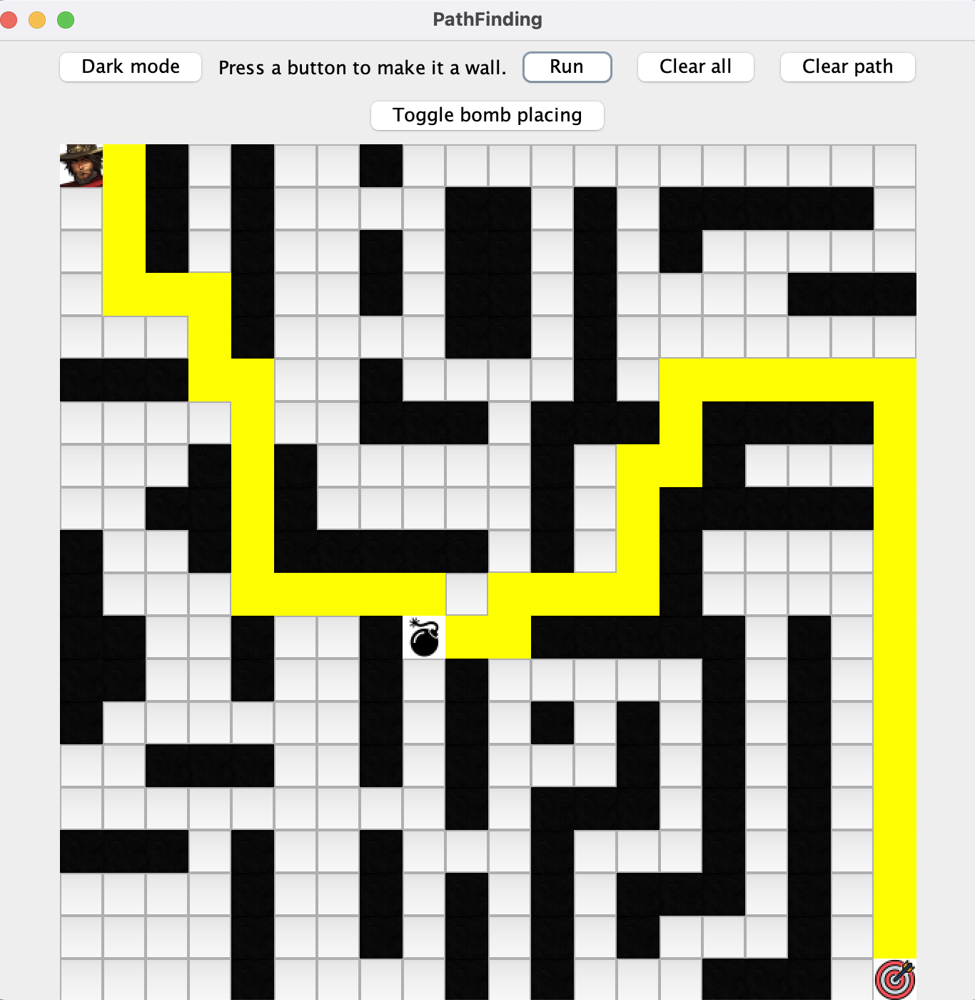

# PathfindingGUI
I made a GUI for a friend that allows the user to place walls on a grid for a BFS path-finding algorithm to navigate around. Since the distance between any two adjacent cells is 1, BFS finds the shortest path in this case. Run Main.class to play the game:
````
java Main
````
Press "run" to generate the path from Cassidy to the target. If you place bombs on the grid, he will visit the bombs too.

